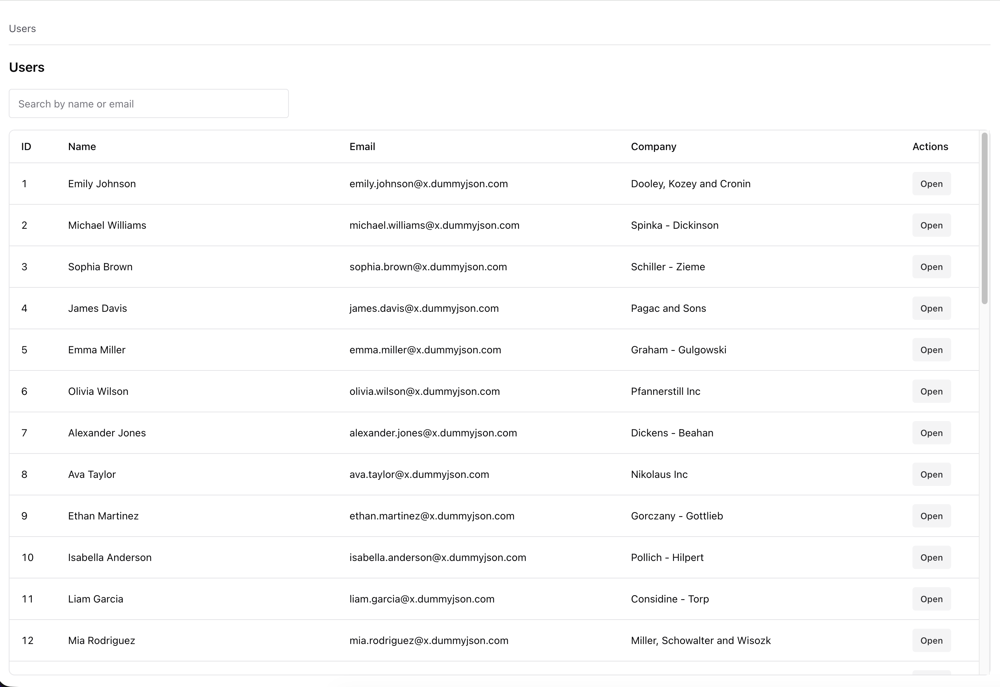
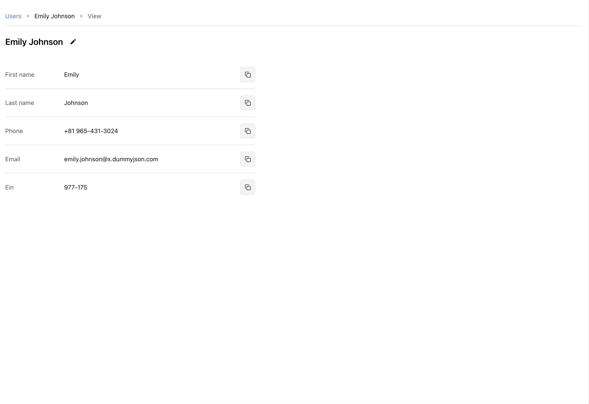
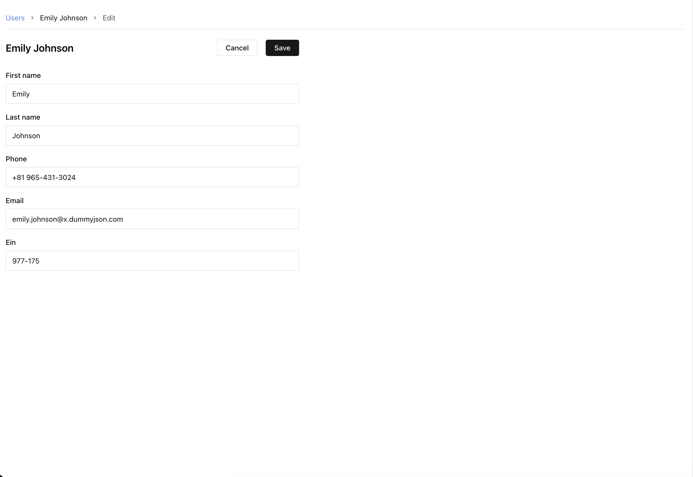

# user-dashboard

Тестовое задание на React: дашборд пользователей

## Почему выбран именно такой стек

### React + TypeScript

- React хорошо подходит для интерфейсов с большим количеством состояний и переиспользуемых компонентов.
- TypeScript снижает количество ошибок на этапе разработки: типы API, пропсов и хуков проверяются до запуска.

### Redux Toolkit + RTK Query

- RTK Query централизует работу с API: запросы, кэширование, статусы загрузки/ошибок, инвалидация.
- В проекте это используется для загрузки списка пользователей и данных по конкретному пользователю.
- Такой подход уменьшает объем ручного кода и делает сетевой слой единообразным.

### TanStack Table + TanStack Virtual

- Для таблицы пользователей важны производительность и контроль рендера.
- `@tanstack/react-table` дает гибкую конфигурацию колонок и контроль отображения.
- `@tanstack/react-virtual` добавляет виртуализацию строк, чтобы интерфейс оставался быстрым при большом количестве данных.

### Chakra UI

- Позволяет быстро собирать аккуратный UI из готовых компонентов.
- Удобно управлять layout/отступами/состояниями компонентов через props.

### React Hook Form

- Хорошо подходит для форм с валидацией и минимальными лишними перерендерами.
- Удобно масштабируется, если форма редактирования станет сложнее.
- В проекте уже заложена основа под форменный сценарий.

## Что реализовано

- Список пользователей с подгрузкой и виртуализированной таблицей.
- Просмотр карточки пользователя по id.
- Редактирование пользователя.
- Маршрутизация и базовая структура для расширения редактирования.
- Поиск пользователей с debounce (600 мс) и серверным запросом.
- Сортировка столбцов в таблице пользователей.
- Создание пользователя в модальном окне с отправкой данных на API.
- Валидация обязательных полей формы (режим проверки `onBlur`).
- Маска для полей `Phone` и `EIN` (разрешены цифры, `+`, `-` и пробел).
- Toast-уведомления для успешных и ошибочных операций.
- Автообновление списка после create/edit через инвалидацию кэша RTK Query.

## Начало работы

```bash
npm i
npm run dev
npm run build
npm run preview
```

## Версия Node

`20.20.2`

## Скриншоты

### Список пользователей



### Карточка пользователя



### Редактирование пользователя


